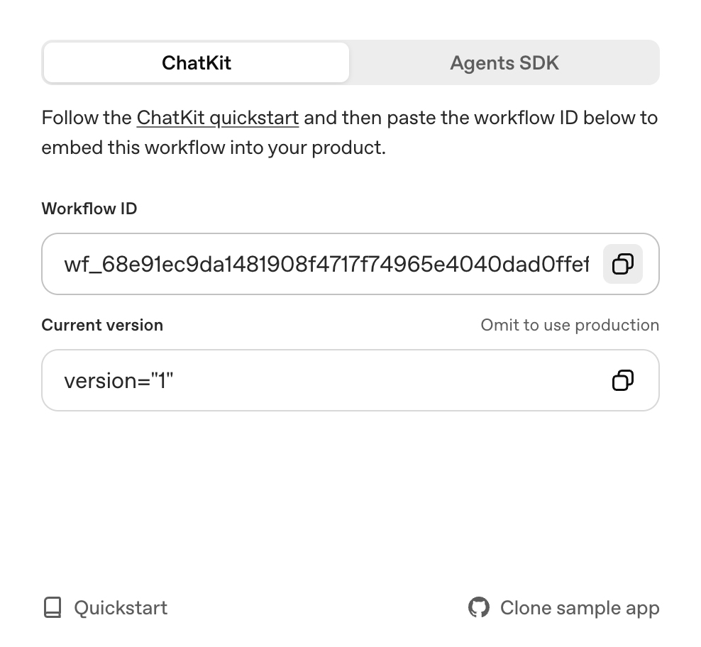

# ChatKit Starter Template

[](LICENSE)


This repository is the simplest way to bootstrap a [ChatKit](http://openai.github.io/chatkit-js/) application. It ships with a minimal Next.js UI, the ChatKit web component, and a ready-to-use session endpoint so you can experiment with OpenAI-hosted workflows built using [Agent Builder](https://platform.openai.com/agent-builder).

## What You Get

- Next.js app with `<openai-chatkit>` web component and theming controls
- API endpoint for creating a session at [`app/api/create-session/route.ts`](app/api/create-session/route.ts)
- Config file for starter prompts, theme, placeholder text, and greeting message

## Getting Started

### 1. Install dependencies

```bash
npm install
```

### 2. Create your environment file

Copy the example file and fill in the required values:

```bash
cp .env.example .env.local
```

You can get your workflow id from the [Agent Builder](https://platform.openai.com/agent-builder) interface, after clicking "Publish":



You can get your OpenAI API key from the [OpenAI API Keys](https://platform.openai.com/api-keys) page.

### 3. Configure ChatKit credentials

Update `.env.local` with the variables that match your setup.

- `OPENAI_API_KEY` — This must be an API key created **within the same org & project as your Agent Builder**. If you already have a different `OPENAI_API_KEY` env variable set in your terminal session, that one will take precedence over the key in `.env.local` one (this is how a Next.js app works). So, **please run `unset OPENAI_API_KEY` (`set OPENAI_API_KEY=` for Windows OS) beforehand**.
- `NEXT_PUBLIC_CHATKIT_WORKFLOW_ID` — This is the ID of the workflow you created in [Agent Builder](https://platform.openai.com/agent-builder), which starts with `wf_...`
- (optional) `CHATKIT_API_BASE` - This is a customizable base URL for the ChatKit API endpoint

> Note: if your workflow is using a model requiring organization verification, such as GPT-5, make sure you verify your organization first. Visit your [organization settings](https://platform.openai.com/settings/organization/general) and click on "Verify Organization".

### 4. Run the app

```bash
npm run dev
```

Visit `http://localhost:3000` and start chatting. Use the prompts on the start screen to verify your workflow connection, then customize the UI or prompt list in [`lib/config.ts`](lib/config.ts) and [`components/ChatKitPanel.tsx`](components/ChatKitPanel.tsx).

### 5. Deploy to Vercel

1) Push this repo to GitHub/GitLab/Bitbucket

2) Create a new Vercel project and import the repo

3) Set these Environment Variables in Vercel (Project Settings → Environment Variables):

   - `OPENAI_API_KEY` — API key from the same org & project as your Agent Builder
   - `NEXT_PUBLIC_CHATKIT_WORKFLOW_ID` — your workflow id (starts with `wf_...`)
   - (optional) `CHATKIT_API_BASE` — defaults to `https://api.openai.com`

4) Build & deploy (framework preset: Next.js). No extra config is required.

5) Add your Vercel domain to OpenAI’s [Domain allowlist](https://platform.openai.com/settings/organization/security/domain-allowlist) before using the app.

Notes:
- The session endpoint at `app/api/create-session/route.ts` runs on the Edge Runtime on Vercel by default.
- If you also run locally, remember a terminal-level `OPENAI_API_KEY` will override `.env.local`.

## Customization Tips

- Adjust starter prompts, greeting text, [chatkit theme](https://chatkit.studio/playground), and placeholder copy in [`lib/config.ts`](lib/config.ts).
- Update the event handlers inside [`components/.tsx`](components/ChatKitPanel.tsx) to integrate with your product analytics or storage.

## References

- [ChatKit JavaScript Library](http://openai.github.io/chatkit-js/)
- [Advanced Self-Hosting Examples](https://github.com/openai/openai-chatkit-advanced-samples)
# agentkitv2
